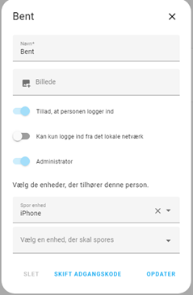
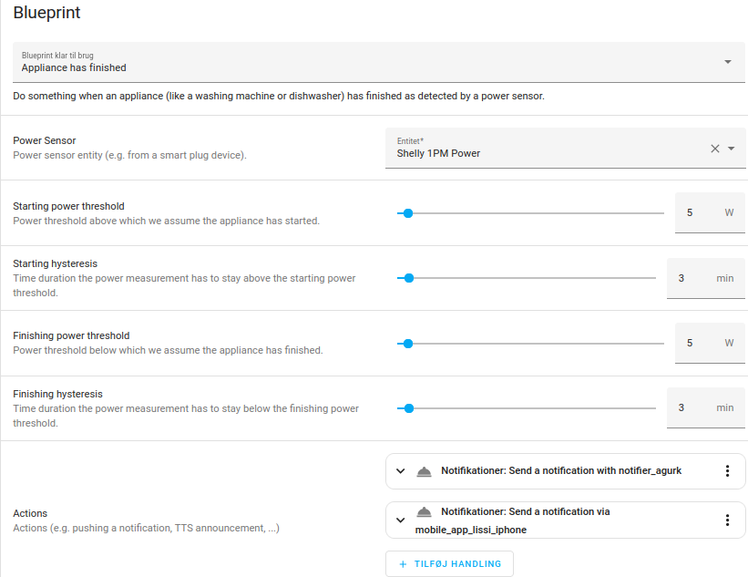

# Automatiseringer
## 1. Personstyring (Device tracker)<br>
Inspiration:<br>
[Switch Based On Presence In Home Assistant](https://www.youtube.com/watch?v=J-b8BAefNGQ)<br>
[Geofencing in Home Assistant](https://www.youtube.com/watch?v=pjAyRN5UiBg)<br>
[Ultimate Presence Detection in Home Assistant](https://www.youtube.com/watch?v=AcxHt_bPlZQ)<br>
<br>
**Setup**
- Homeassistant<br>
  - Indstillinger<br>
    - Vælg Personer<br>
      - Tilføj person - vælg enhed som skal spores



- Installer **HomeAssistant** på mobiltelefon<br>
  Under indstillinger vælges **Companion App**<br>
  Vælg **Lokalitet** og giv tilladelser


- **ESPresense** (en anden Decive tracker)
  - se [**6. ESPresense og MQTT**](../README.md#6-espresense-og-mqtt)<br><br>

- **Definer gruppe** (/config/groups.yaml)<br>
  Hvis flere personer skal kunne trackes samtidig kan der oprettes en gruppe<br>
  Hvis 'all: false' skal kun 1 være hjemme<br>
  Hvis 'all: true' skal alle være hjemme<br>


- entity: group.somebody home<br>


- **Eksempel på brug af automatisering**
  - Person kommer hjem og lys tændes hvis sol er gået ned. (kunne også teste på ’somebody home’)
  
```YAML
alias: Bent hjemme
description: Bent hjemme eller ude
trigger:
  - platform: state
    entity_id:
      - person.bent
    from: not_home
    to: home
    id: bent hjemme
  - platform: state
    entity_id:
      - person.bent
    id: bent ude
    from: home
    to: not_home
condition: []
action:
  - choose:
      - conditions:
          - condition: trigger
            id: bent hjemme
        sequence:
          - if:
              - condition: state
                entity_id: sun.sun
                state: below_horizon
            then:
              - type: turn_on
                device_id: 15dce4b5bd0e93580a48dfcf0735788a
                entity_id: light.entre_ikea_806lm_level_on_off
                domain: light
                brightness_pct: 100
      - conditions:
          - condition: trigger
            id: bent ude
        sequence:
          - type: turn_off
            device_id: 4bc5cef82ee22c1271d1d25126d5f2e6
            entity_id: switch.light_relay_1
            domain: switch
    default:
      - stop: ukendt betingelse
mode: single
```

## 2. Entre
* [Link til esp32 projekt](./../ESPHome/README.md#1-styringspanel-esp8266-12-m-oled-lcd)
* YAML kode ved bevægelse i entre
```YAML
alias: Bevægelse Entre 
description: ""
trigger:
  - platform: state
    entity_id: binary_sensor.pir_sensor
    from: "off"
    to: "on"
    for:
      hours: 0
      minutes: 0
      seconds: 0
condition:
  - condition: state
    entity_id: sun.sun
    state: below_horizon
action:
  - choose:
      - conditions:
          - condition: time
            after: "00:00"
            before: "06:00"
        sequence:
          - type: turn_on
            device_id: 15dce4b5bd0e93580a48dfcf0735788a
            entity_id: light.entre_ikea_806lm_level_on_off
            domain: light
            brightness_pct: 10
    default:
      - type: turn_on
        device_id: 15dce4b5bd0e93580a48dfcf0735788a
        entity_id: light.entre_ikea_806lm_level_on_off
        domain: light
        brightness_pct: 80
  - wait_for_trigger:
      - platform: state
        entity_id: binary_sensor.pir_sensor
        from: "on"
        to: "off"
        for:
          hours: 0
          minutes: 0
          seconds: 0
  - type: turn_off
    device_id: 15dce4b5bd0e93580a48dfcf0735788a
    entity_id: light.entre_ikea_806lm_level_on_off
    domain: light
mode: single
```
* YAML kode ved tryk på **button_1** tænd lys manuelt
```YAML
alias: Entre lys
description: ""
trigger:
  - platform: state
    entity_id: binary_sensor.entre_button_1
    from: "off"
    to: "on"
condition: []
action:
  - choose:
      - conditions:
          - condition: device
            type: is_off
            device_id: 15dce4b5bd0e93580a48dfcf0735788a
            entity_id: light.entre_ikea_806lm_level_on_off
            domain: light
        sequence:
          - type: turn_on
            device_id: 15dce4b5bd0e93580a48dfcf0735788a
            entity_id: light.entre_ikea_806lm_level_on_off
            domain: light
            brightness_pct: 100
    default:
      - type: turn_off
        device_id: 15dce4b5bd0e93580a48dfcf0735788a
        entity_id: light.entre_ikea_806lm_level_on_off
        domain: light
mode: single
```

## 3. Postkasse alarm
- Aqara vibrationscensor Zigbee monteret på postkasselåg.<br>
  For at forbedre rækkevidden på Zigbee signalet, sidder der en Ikea signalforstærker på indermuren tæt på postkassen.<br>
  Ulempen ved vibrationssensor er at kraftig blæst kan give falske meldinger.<br>
  Ud over melding på Lovelace sendes en melding via Telegram.
- YAML kode
```YAML
alias: Post
description: ""
trigger:
  - type: vibration
    platform: device
    device_id: 720f09636613695b19483d8538c5e0ab
    entity_id: binary_sensor.lumi_lumi_vibration_aq1_ias_zone
    domain: binary_sensor
condition: []
action:
  - service: notify.notifier_agurk
    data:
      message: Ny post
  - service: input_boolean.turn_on
    data: {}
    target:
      entity_id: input_boolean.postkasse
mode: single
```

## 4. Vaskemaskine færdig
- Shelly 1PM Power måler strømforbrug<br>
  Hvis strømforbrug falder til under 5W i 3 min. anses vask for færdig<br>

- YAML kode for Blueprint
```YAML
alias: Vaskemaskine færdig 
description: ""
use_blueprint:
  path: >-
    sbyx/notify-or-do-something-when-an-appliance-like-a-dishwasher-or-washing-machine-finishes.yaml
  input:
    power_sensor: sensor.shelly1pm_8caab55fd8f1_power
    actions:
      - service: notify.notifier_agurk
        data:
          message: Vaskemaskine færdig
      - service: notify.mobile_app_lissi_iphone
        data:
          message: Vaskemaskine færdig
    starting_hysteresis: 3
    finishing_threshold: 5
    finishing_hysteresis: 3

```

<<<<<<< HEAD
## 5. Affaldstømning
- HACS for Odense Renovation installeret<br>
- Dagen før kl. 18 sendes en meddelelse via Telegram<br>
=======
## 5. Affald afhentes i morgen
- Sender besked til mobil dagen før kl. 18 via Telegram
>>>>>>> 7ac29b45a844a3b5bd46f3e8b6b9672c208fe669
- YAML kode
```YAML
alias: affald
description: ""
trigger:
  - platform: time
    at: "18:00:00"
condition: []
action:
  - choose:
      - conditions:
          - condition: template
            value_template: >-
              {{
<<<<<<< HEAD
              is_state_attr("sensor.odense_renovation_odense_reno_xxxxxx_glas_metal_papir",
=======
              is_state_attr("sensor.odense_renovation_odense_reno_fengersvej_31_glas_metal_papir",
>>>>>>> 7ac29b45a844a3b5bd46f3e8b6b9672c208fe669
              "countdown_days", 1) }}
        sequence:
          - service: notify.notifier_agurk
            data:
              message: I morgen hentes mad  metal og papir
      - conditions:
          - condition: template
            value_template: >-
              {{
<<<<<<< HEAD
              is_state_attr("sensor.odense_renovation_odense_reno_xxxxxx_plast_kartoner",
=======
              is_state_attr("sensor.odense_renovation_odense_reno_fengersvej_31_plast_kartoner",
>>>>>>> 7ac29b45a844a3b5bd46f3e8b6b9672c208fe669
              "countdown_days", 1) }}
        sequence:
          - service: notify.notifier_agurk
            data:
              message: I morgen hentes mad og plast
    default: []
mode: single
<<<<<<< HEAD
```

=======
```
>>>>>>> 7ac29b45a844a3b5bd46f3e8b6b9672c208fe669
