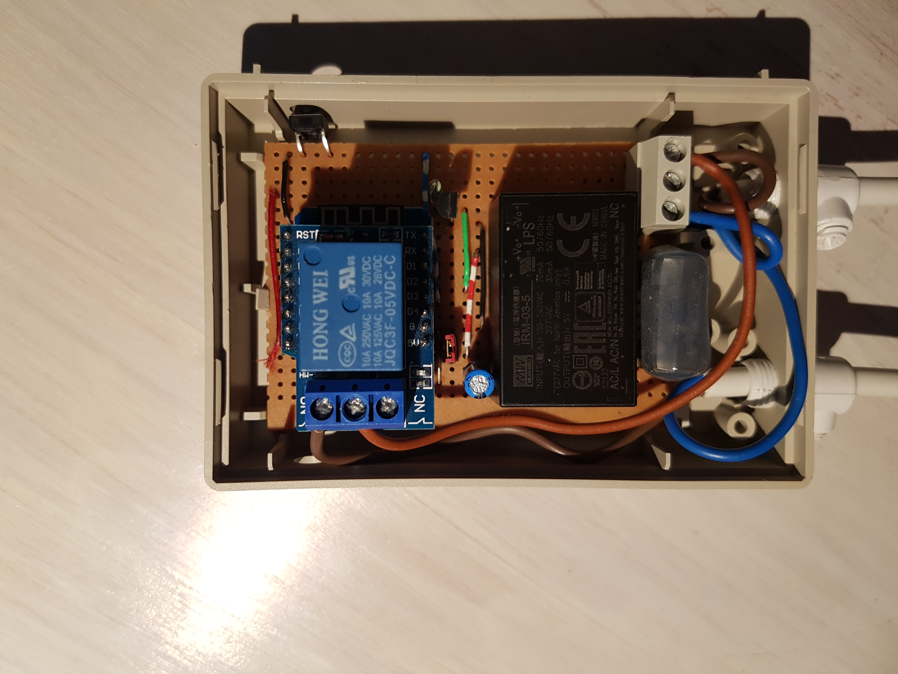

# ESPHome projekter
### 1. Styringspanel ESP8266-12 m. OLED LCD
- styrer Ikea loftlys i entre ved bevægelse
- display viser:
   - ur
   - ude og indetemperatur
   - om døre og vinduer er lukket
   - vaskemaskine forbrug
- Hardware:
  -  Esp8266 Wemos D1 Mini
  -  Display OLED LCD 0.96" 12864 I2C
  -  Motion PIR Module HC-SR501
 - esp kode:
```YAML
esphome:
  name: esp8266_12_gang
  platform: ESP8266
  board: d1_mini

wifi:
  networks:
  - ssid: !secret FV_WIFI_ssid
    password: !secret FV_WIFI_pass
  - ssid: !secret BGS_WIFI_ssid
    password: !secret BGS_WIFI_pass

  # Enable fallback hotspot (captive portal) in case wifi connection fails
  ap:
    ssid: "Esp8266 12 Gang Fallback Hotspot"
    password: !secret My_AP_pass

captive_portal:

# Enable logging
logger:

# Enable Home Assistant API
api:

ota:

time:
  - platform: homeassistant
    id: esptime

sensor:
  - platform: homeassistant
    id: inside_temperature
    entity_id: sensor.netatmo_fv_vejr_indoor_temperature
    internal: true

  - platform: homeassistant
    id: outside_temperature
    entity_id: sensor.netatmo_fv_vejr_fv_ude_temperature
    internal: true
    
  - platform: homeassistant
    id: vaskemaskine_forbrug
    entity_id: sensor.shelly1pm_8caab55fd8f1_power
    internal: true
  
binary_sensor:
  - platform: homeassistant
    id: front_door
    entity_id: binary_sensor.ds01_ias_zone
    internal: true
    
  - platform: homeassistant
    id: gate
    entity_id: binary_sensor.ds02_ias_zone
    internal: true
    
  - platform: homeassistant
    id: bad
    entity_id: binary_sensor.lumi_lumi_sensor_magnet_aq2_on_off
    internal: true
    
  - platform: gpio
    pin: 
      number: D3
      mode: INPUT_PULLUP
      inverted: True
    name: "entre_button_1"
    
  - platform: gpio
    pin: 
      number: D4
      mode: INPUT_PULLUP
      inverted: True
    name: "entre_button_2"
    
  - platform: gpio
    pin: 
      number: D0
    name: "PIR Sensor"
    id: pir_sensor
    device_class: motion
    on_press:
      then:
        - display.page.show: page1
        - component.update: my_display
        - delay: 30s
    on_release:
      then:
        - display.page.show: page2
        
font:
  - file: "comic.ttf"
    id: my_font
    size: 10
    
  - file: "comic.ttf"
    id: my_font1
    size: 20

i2c:
  sda: D1
  scl: D2
  scan: False

display:
  - platform: ssd1306_i2c
    model: "SH1106 128x64"
    id: my_display
#    reset_pin: D0
    address: 0x3C
    pages:
      - id: page1
        lambda: |-

          // Print time in HH:MM format
          it.strftime(127, 20, id(my_font1), TextAlign::BASELINE_RIGHT, "%H:%M", id(esptime).now());
      
          it.printf(0, 60, id(my_font), TextAlign::BASELINE_LEFT, "M: %s", id(pir_sensor).state ? "ON" : "OFF");
      
          it.printf(127, 60, id(my_font), TextAlign::BASELINE_RIGHT, "Door: %s", id(front_door).state ? "OPEN" : "CLOSED");

          it.printf(127, 50, id(my_font), TextAlign::BASELINE_RIGHT, "Sleep: %s", id(gate).state ? "OPEN" : "CLOSED");
      
          it.printf(127, 40, id(my_font), TextAlign::BASELINE_RIGHT, "Bath: %s", id(bad).state ? "OPEN" : "CLOSED"); 
      
          it.printf(0, 40, id(my_font), TextAlign::BASELINE_LEFT, "Wash:");      
          it.printf(0, 50, id(my_font), TextAlign::BASELINE_LEFT, "%.1fW", id(vaskemaskine_forbrug).state); 
      
          // Print inside temperature (from homeassistant sensor)
          if (id(inside_temperature).has_state()) {
            it.printf(0, 10, id(my_font), TextAlign::BASELINE_LEFT , "In     %.1f°", id(inside_temperature).state);
          }

          // Print outside temperature (from homeassistant sensor)
          if (id(outside_temperature).has_state()) {
            it.printf(0, 20, id(my_font), TextAlign::BASELINE_LEFT , "Out   %.1f°", id(outside_temperature).state);
          }
      - id: page2
        lambda: |-
          it.fill(COLOR_OFF);
```

### 2. ESP32-Cam

### 3. Regnmåler

### 4. Tænd/sluk relæ m. ESP8266-12
- 220V relæ bruges til forskellige tænd/sluk opgaver
- Hardware:
  -  Esp8266 Wemos D1 Mini
  -  Relay shield for Wemos D1 Mini
  -  Hi-Link HLK-PM05 AC-DC 5V Step Down Buck
- 
- esp kode:
```YAML
esphome:
  name: esp8266_12_kontakt
  platform: ESP8266
  board: d1_mini

wifi:
  networks:
  - ssid: !secret FV_WIFI_ssid
    password: !secret FV_WIFI_pass
  - ssid: !secret BGS_WIFI_ssid
    password: !secret BGS_WIFI_pass

  # Enable fallback hotspot (captive portal) in case wifi connection fails
  ap:
    ssid: "Esp8266 12 Kontakt"
    password: !secret My_AP_pass

captive_portal:

# Enable logging
logger:

# Enable Home Assistant API
api:

ota:

dallas:
  - pin: D2
  
sensor:
  - platform: dallas
#    address: 0xDD0000031EFB0428
    address: 0xEE00039843258028
    name: "Kontakt Temperature"
    
binary_sensor:
  - platform: gpio
    pin: 
      number: D3
      mode: INPUT_PULLUP
      inverted: True
    name: "button_1"
    on_press:
     - switch.toggle: relay_light_1

switch:
  - platform: gpio
    name: Light relay 1
    pin: D1
    id: relay_light_1
    

```
### 5. Temperaturføler m. ESP8266-01 og DS18B20
- Hardware:
  - ESP8266-01
  - Dallas DS18B20
- esp kode:
```YAML
esphome:
  name: esp8266_01_temp
  platform: ESP8266
  board: esp01_1m
  
  platformio_options:
    upload_speed: 115200

wifi:
  networks:
  - ssid: !secret FV_WIFI_ssid
    password: !secret FV_WIFI_pass
  - ssid: !secret BGS_WIFI_ssid
    password: !secret BGS_WIFI_pass
  
  # Enable fallback hotspot (captive portal) in case wifi connection fails
  ap:
    ssid: "Esp8266 01 Temp Fallback Hotspot"
    password: !secret My_AP_pass
    

captive_portal:

# Enable logging
logger:

# Enable Home Assistant API
api:

ota:

dallas:
  - pin: GPIO2
  
sensor:
  - platform: dallas
    address: 0x4B3C01B5567D6928
    resolution: 12
    accuracy_decimals: 2
    name: "Temperature #1" 
```
